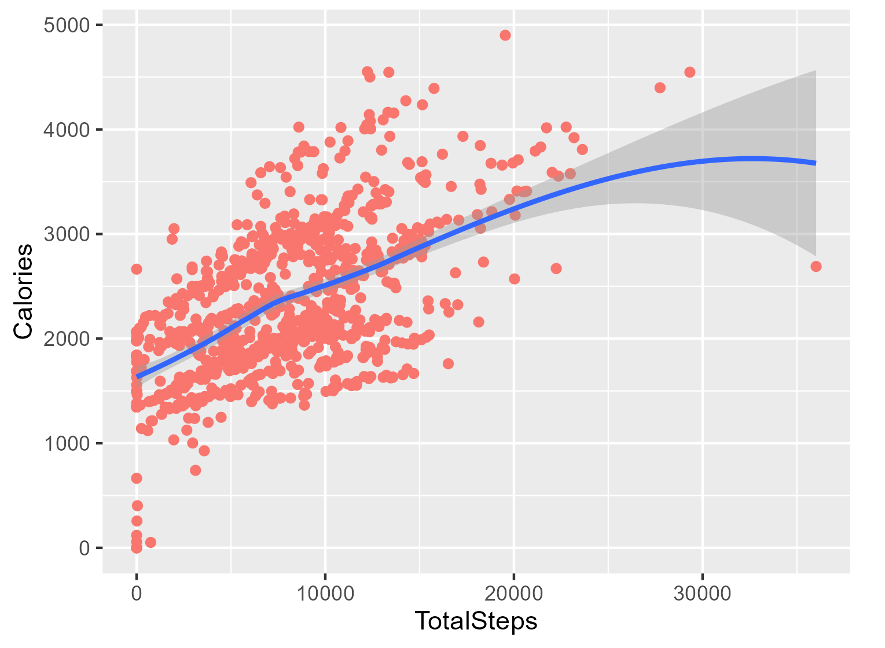
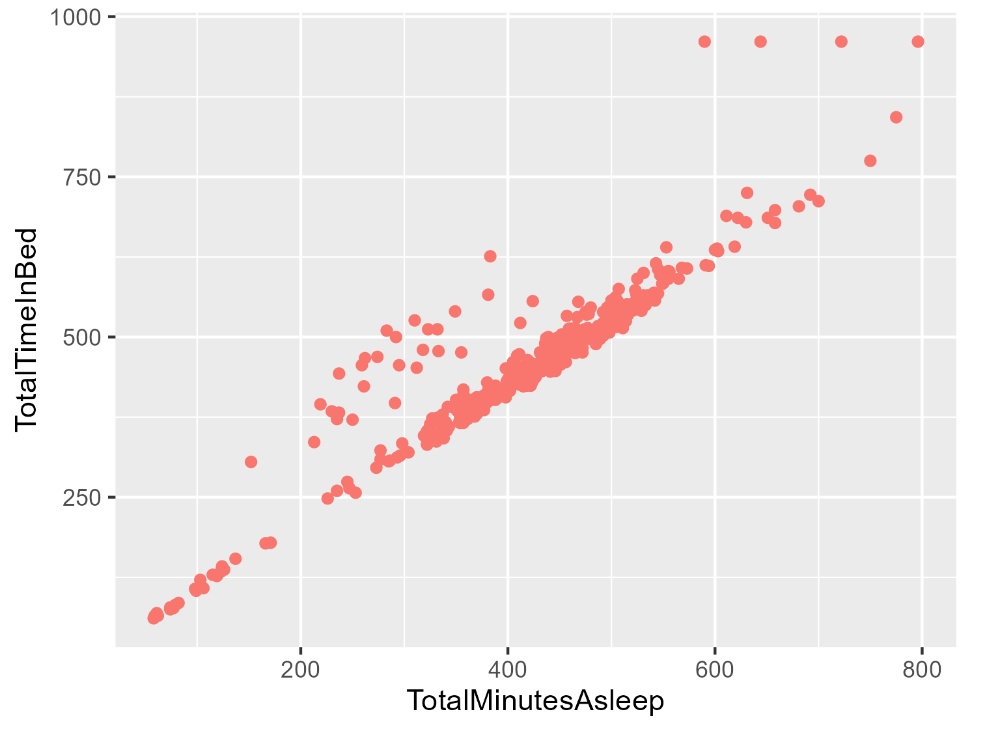
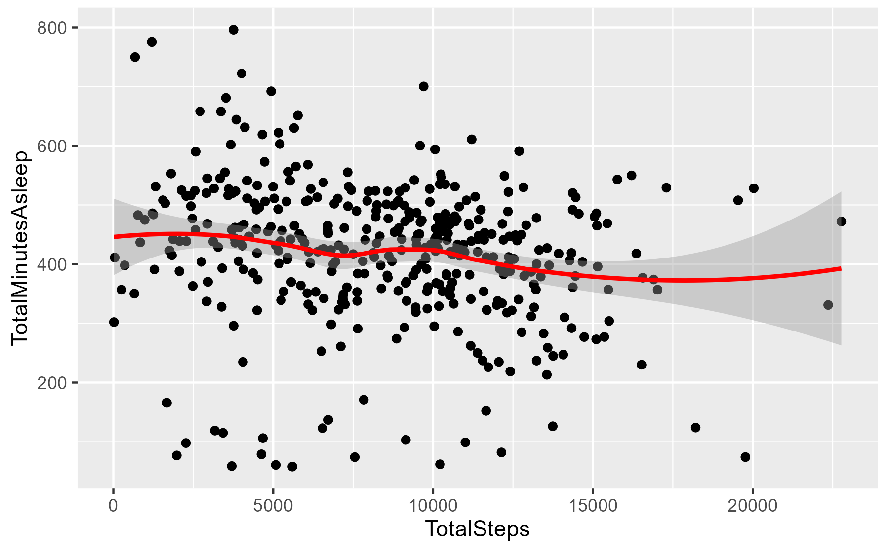
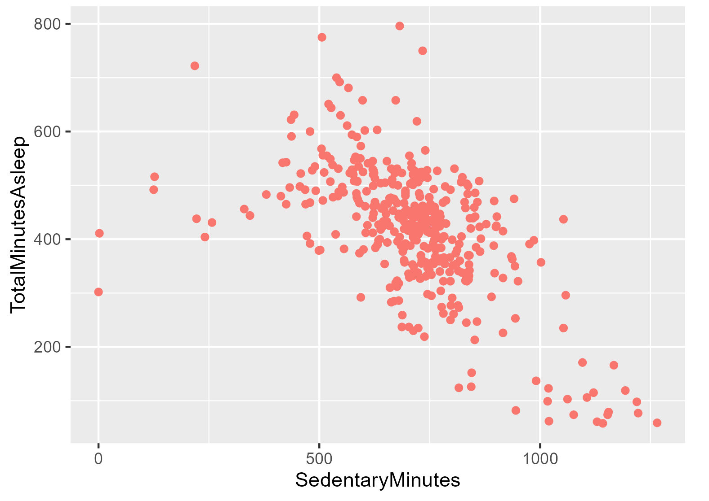
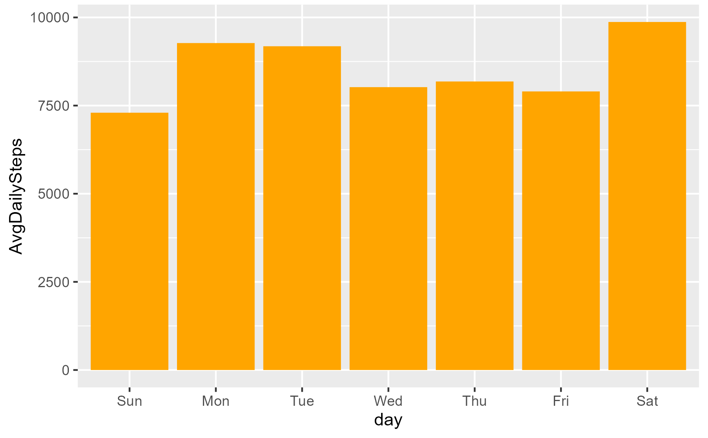
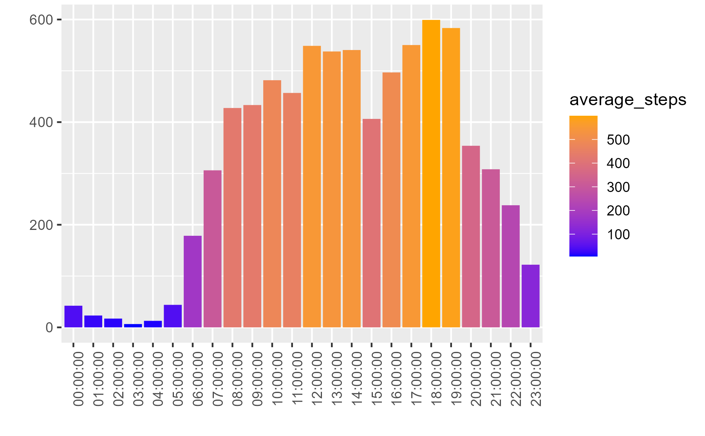

# Case Study 2: How Can a Wellness Technology Company Play It Smart?
# Bellabeat


## Table of Contents

* Introduction
* Ask Phase
* Prepare Phase
* Process Phase
* Analyze Phase
* Share Phase
* Act Phase(Conclusion)
  
These past few months i was doing a Google Data Analytics Certification Course from Coursera. As a part of it i have done Case study 2 as my Capstone Project.This case study follows 6 steps of the data analysis process: ask, prepare, process, analyze, share, and act Phase.

# Introduction
Bellabeat is a high-tech company that manufactures health-focused smart products for women.They offer different smart devices that collect data on activity, sleep, stress, and reproductive health to empower women with knowledge about their own health and habits.Although Bellabeat is a successful small company, they have the potential to become a larger player in the global smart device market. Urška Sršen, cofounder and Chief Creative Officer of Bellabeat, believes that analyzing smart device fitness data could help unlock new growth opportunities for the company.

The main focus of this case is to analyze smart devices fitness data and determine how it could help unlock new growth opportunities for Bellabeat. We will focus on one of Bellabeat’s products: Bellabeat app.

The Bellabeat app provides users with health data related to their activity, sleep, stress, menstrual cycle, and mindfulness habits. This data can help users better understand their current habits and make healthy decisions. The Bellabeat app connects to their line of smart wellness products

# Ask Phase
**Business Task :**

To Identify trends in how consumers use non-Bellabeat smart devices to apply insights into Bellabeat’s marketing strategy.

**Key Stakeholders:**

* Urška Sršen - Bellabeat cofounder and Chief Creative Officer
* Sando Mur - Bellabeat cofounder and key member of Bellabeat executive team
* Bellabeat Marketing Analytics team
  
# Prepare Phase
The data used for our case study is FitBit Fitness Tracker Data.This dataset is stored in Kaggle and was made available through Mobius.

**About Dataset:**

This Kaggle data set contains personal fitness tracker from thirty fitbit users. Thirty eligible Fitbit users consented to the submission of personal tracker data, including minute-level output for physical activity, heart rate, and sleep monitoring. It includes information about daily activity, steps, and heart rate that can be used to explore users’ habits.This data is from March 2016 through May 2016 The dataset contains 18 CSV files.

**Credibility of Dataset:**

Due to the limitation of size and not having any demographic information we could encounter a sampling bias. The problem we encounter is that the dataset is not current,meaning that user habits may have changed over the years.

### Installed and Loaded Packages
```
# installing packages

install.packages("tidyverse")
install.packages("lubridate")
install.packages("dplyr")
install.packages("ggplot2")
install.packages("tidyr")
install.packages("here")
install.packages("skimr")
install.packages("janitor")

#Loading Packages

library(tidyverse)
library(lubridate)
library(dplyr)
library(ggplot2)
library(tidyr)
library(here)
library(skimr)
library(janitor)

```


# Process Phase

**Importing datasets:**

The following datasets are imported.Due to the the small sample we won't consider for this analysis Weight (8 Users) and heart rate (7 users)

```
activity <- read.csv("C:/Fitness/Fitabase Data 4.12.16-5.12.16/dailyActivity_merged.csv")
calories <- read.csv("C:/Fitness/Fitabase Data 4.12.16-5.12.16/hourlyCalories_merged.csv")
sleep <- read.csv("C:/Fitness/Fitabase Data 4.12.16-5.12.16/sleepDay_merged.csv")
steps <- read.csv("C:/Fitness/Fitabase Data 4.12.16-5.12.16/hourlySteps_merged.csv")
```

Now i am good to clean the data.Before that I will take a look at each data frame to familiarize myself with the data and check errors in these datasets.


**Dataset Preview:**
```
head(activity)
tail(activity)
colnames(activity)
​
head(calories)
tail(calories)
colnames(calories)

head(sleep)
tail(sleep)
colnames(sleep)
​
head(steps)
tail(steps)
colnames(steps)
```

**Number of users:**

Before cleaning the dataset i have make sure how many unique users are per data frame.

```
n_distinct(activity$Id)
n_distinct(calories$Id)
n_distinct(sleep$Id)
n_distinct(steps$Id)
```
**Checking for Dulicates:**

```
sum(duplicated(activity))
sum(duplicated(sleep))
sum(duplicated(calories))
sum(duplicated(steps))
```
0

3

0

0


**Removing duplicates and N/A :**
```
activity <- activity %>%
  distinct() %>%
  drop_na()
​
calories <- calories %>%
  distinct() %>%
  drop_na()
​
sleep <- sleep %>%
  distinct() %>%
  drop_na()
​
steps <- steps %>%
  distinct() %>%
  drop_na()

```
**Checking if Duplicates is removed :**
```
sum(duplicated(sleep))
```
0


**Cleaning the datetime column:**
```
​
#calories
calories$ActivityHour=as.POSIXct(calories$ActivityHour, format="%m/%d/%Y %I:%M:%S %p", tz=Sys.timezone())
calories$time <- format(calories$ActivityHour, format = "%H:%M:%S")
calories$date <- format(calories$ActivityHour, format = "%m/%d/%y")
print(calories)
​
#sleep
sleep$SleepDay=as.POSIXct(sleep$SleepDay, format="%m/%d/%Y %I:%M:%S %p", tz=Sys.timezone())
sleep$date <- format(sleep$SleepDay, format = "%m/%d/%y")
print(sleep)
​
# activity
activity$ActivityDate=as.POSIXct(activity$ActivityDate, format="%m/%d/%Y", tz=Sys.timezone())
activity$date <- format(activity$ActivityDate, format = "%m/%d/%y")
print(activity)
​
# steps
steps$ActivityHour=as.POSIXct(steps$ActivityHour, format="%m/%d/%Y %I:%M:%S %p", tz=Sys.timezone())
steps$time <- format(steps$ActivityHour, format = "%H:%M:%S")
steps$date <- format(steps$ActivityHour, format = "%m/%d/%y")
print(steps)
```

# Analyze Phase
```
# activity
activity %>%  
  select(TotalSteps,
         TotalDistance,
         SedentaryMinutes, Calories) %>%
  summary()
​
#  num of active minutes per category
activity %>%
  select(VeryActiveMinutes, FairlyActiveMinutes, LightlyActiveMinutes) %>%
  summary()
​
#sleep
sleep %>%
  select(TotalSleepRecords, TotalMinutesAsleep, TotalTimeInBed) %>%
  summary()
​
#calories
calories %>%
  select(Calories,time) %>%
  summary()
​
#steps
steps %>%
  select(StepTotal,time) %>%
  summary()
```
**Observations from the above Summaries:**

* Sedetary minutes on average is 16.5 hours.
* The average participant burns 97 calories per hour.
* The majority of the avaerage participants are lightly active for 3 hours.
* The average number of steps per day is 7638.According to Centers for Disease Control and Prevention(CDC),recommends people to take 10,000 steps daily for healthy adults to achieve health benefits.
* an average calories a participant burn per hour is 97.3.
* an average participant sleep for 7 hours.

# Share Phase

From the above observations, let the analysis be done in depth with the help of visualization for easy understanding. Before visualization, I will merge two of the datasets. I have joined activity and sleep datasets using an inner join on columns id and date.


**Merging two datasets:**

```
merged_data <- merge(sleep, activity, by=c ('Id', 'date'))
glimpse(merged_data)
```

### Total Steps vs Calories
```
ggplot(data = activity, aes(x = TotalSteps, y = Calories)) + geom_point(aes(color = "Orange")) + geom_smooth() + labs(title = "Total Steps vs. Calories")

cor(activity$TotalSteps,activity$Calories)
```


From the above analysis there is a correlation between total number of steps taken and calories burned. The more steps each participant takes, the more calories they burn.


### Total time asleep vs Total time in bed

```
ggplot(data = sleep, aes(x = TotalMinutesAsleep, y = TotalTimeInBed)) + geom_point(aes(color = "Orange")) + labs(title = "Total time asleep vs Total time in bed")

cor(sleep$TotalMinutesAsleep,sleep$TotalTimeInBed)
```


We can see a positive correlation between total time asleep vs total time in bed. To improve sleep quality for its users and ensure consistency, bellabeat should consider having a section where users can customize their sleep schedule .

### Total Minutes Asleep vs Total Steps
```
ggplot(data = merged_data , aes(x = TotalSteps , y = TotalMinutesAsleep)) + geom_point() + labs(title = "Total Steps vs TotalMinutesAsleep") + geom_jitter() +
  geom_smooth(color = "red")

cor(merged_data$TotalMinutesAsleep,merged_data$TotalSteps)
```


-0.1903439

There is no correlation between  activity  based on total steps and the amount of minutes users sleep a day.

### Sleep and Inactive Time



```
ggplot(data = merged_data, mapping = aes(x = SedentaryMinutes, y = TotalMinutesAsleep)) +
  geom_point(aes(color = "pink") ) + labs(title= "Sleep Duration and Sedentary Time") 

cor(merged_data$TotalMinutesAsleep,merged_data$SedentaryMinutes)

```
 -0.6010731
 
 From looking at the graph above, we can see there is a negative correlation between total inactive time and TotalMinutesAsleep. This means that the less active a participant is, the less sleep they tend to get. 

 ### Steps taken in each day
 
```
merged_data <- mutate(merged_data, day = wday(SleepDay, label = TRUE))
summarized_activity_sleep <- merged_data %>% 
  group_by(day) %>% 
  summarise(AvgDailySteps = mean(TotalSteps),
            AvgAsleepMinutes = mean(TotalMinutesAsleep),
            AvgAwakeTimeInBed = mean(TotalTimeInBed), 
            AvgSedentaryMinutes = mean(SedentaryMinutes),
            AvgLightlyActiveMinutes = mean(LightlyActiveMinutes),
            AvgFairlyActiveMinutes = mean(FairlyActiveMinutes),
            AvgVeryActiveMinutes = mean(VeryActiveMinutes), 
            AvgCalories = mean(Calories))
head(summarized_activity_sleep)

ggplot(data = summarized_activity_sleep, mapping = aes(x = day, y = AvgDailySteps)) + geom_col(fill = "Blue") + labs(title = "Daily Step Count")

```



From this bar garph , it is clear that most of the participants are active in saturdays and less in sundays.

### Total Steps vs Total Minutes Asleep
```
ggplot(data = merged_data , aes(x = TotalSteps , y = TotalMinutesAsleep)) + geom_point() + labs(title = "Total Steps vs TotalMinutesAsleep") + geom_jitter() +
  geom_smooth(color = "red")
cor(merged_data$TotalMinutesAsleep,merged_data$TotalSteps)
```

There is no correlation between daily activity level based on steps and the amount of minutes users sleep a day.

 ### hourly steps throughout the day

 ```
steps %>% group_by(time) %>% summarize(average_steps = mean(StepTotal)) %>%
  ggplot() + geom_col(mapping = aes(x=time, y = average_steps, fill = average_steps)) + 
  labs(title = "Hourly steps throughout the day", x="", y="") + 
  scale_fill_gradient(low = "blue", high = "orange")+
  theme(axis.text.x = element_text(angle = 90))
```


 From this chart we can say that users are most active from 8am to 7pm.User walks more steps during lunch time from 12pm to 2pm and evenings from 5pm and 7pm.

# Act Phase

**Conclusion:**

Knowing that our main target is young and adult women, I continue to find trends to create a marketing strategy focused on them. After analyzing the results we get, I have come up with recommendations for Bellabeat to develop their marketing strategies.

* The average number of users who walk a few steps per day is 7,638. We can encourage customers to reach at least 8,000 steps daily by sending them alarms or daily notifications if they haven't reached the target, and Bellabeat can suggest their users take at least 8,000 steps per day by explaining the benefits that come with it, posting motivational and inspirational posts, or giving pop-up messages for their users as a push.

* Participants seem to be the least active on Sundays. Bellabeat can use this to motivate users to go out and continue exercising on Sundays.
  
* Based on our results, we can see that users sleep less than 8 hours a day. They could set up a desired time to go to sleep and receive a notification minutes before going to sleep. Also offer helpful resources to help customers sleep, for example, podcasts with relaxing music and sleeping tips.
  
* Bellabeat can suggest diet plans for users with different needs, like weight loss diets and weight gain diets.
    
* The majority of participants are lightly active. Bellabeat should offer a progression system in the app to encourage participants to become at least fairly active.
  
* Some people can get unmotivated by notifications, so for this matter, we could give them daily coupons or offers by conducting small games for a limited period of time. The game would consist of reaching different levels based on the number of steps walked every day. For each level, the user would win a certain amount of stars or coins that would be made available for merchandise or discounts on other Bellabeat products.

  
Thank You !
